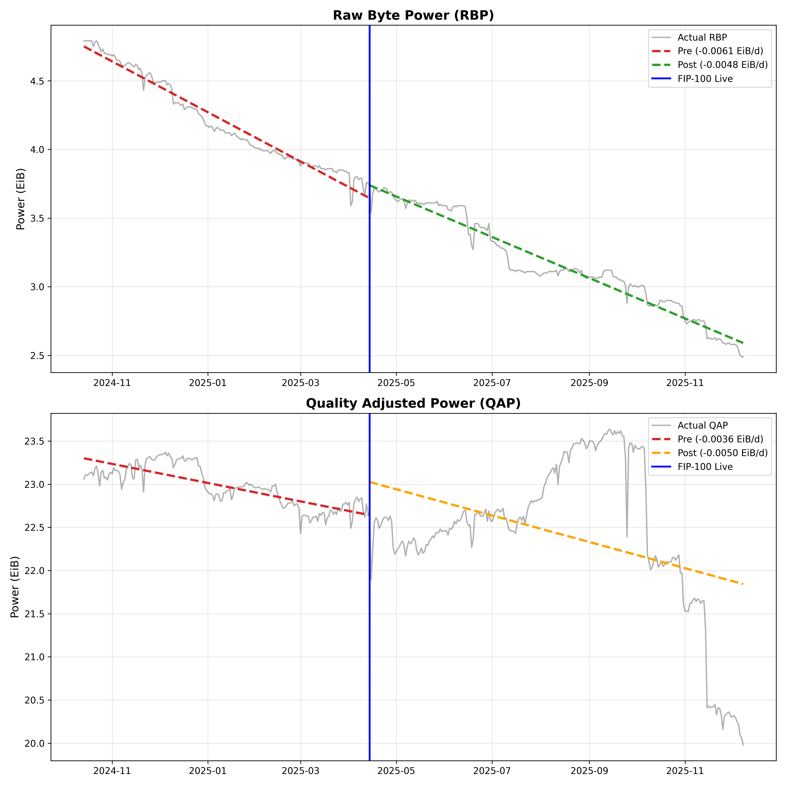
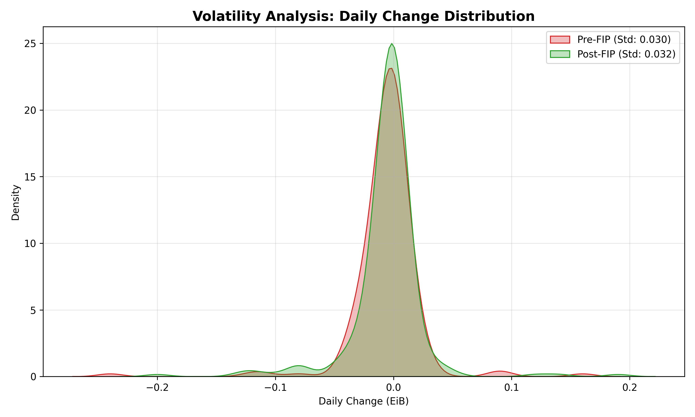

# FIP-100 Impact Analysis: Physical vs. Consensus Power Trends

**Date:** 12 Dec 2025
**Author:** Luca – CryptoEconLab

## 1. Executive Summary

**Conclusion:** The available data suggests that FIP-100 is not the primary accelerator of the storage hardware decline.

Our analysis highlights diverging trends between physical hardware and consensus power since the proposal's activation (April 14, 2025):
* **Physical Hardware (RBP):** The rate of decline has **slowed down** (decelerated).
* **Consensus Power (QAP):** The rate of decline has **accelerated**.
* **Implication:** This divergence suggests that the decline in network power is driven by **FIL+ lifecycle dynamics** (e.g., expiration of 10x sectors or reduced FIL+ adoption) rather than a mass unplugging of hardware due to the FIP-100 fee structure.

## 2. Visual Evidence

**Figure 1: RBP vs QAP Trends**
* **Top Panel (RBP):** The Green trend line (Post-FIP) is flatter than the Red line (Pre-FIP), indicating a slower rate of loss for physical hardware.
* **Bottom Panel (QAP):** The Orange trend line is steeper, reflecting a faster rate of loss for consensus power.



**Figure 2: Volatility Analysis**
* The overlap of the two curves demonstrates that the distribution of daily changes (volatility) has remained consistent over time, indicating no destabilization of network operations.*



## 3. Key Findings

### A. RBP Decline Has Slowed (Retention Improved)
* **Pre-FIP Trend:** -6.1 PiB / day
* **Post-FIP Trend:** -4.8 PiB / day
* **Observation:** The daily loss of physical storage is **~21% lower** in the period following FIP-100 activation compared to the period immediately prior.

### B. QAP Decline Has Accelerated (Loss Worsened)
* **Pre-FIP Trend:** -3.6 PiB / day
* **Post-FIP Trend:** -5.0 PiB / day
* **Observation:** The daily loss of QAP has increased by **~38%**, diverging from the physical hardware trend.

### C. Stability Check (Variance)
* **Pre-FIP Std Dev:** 0.030
* **Post-FIP Std Dev:** 0.032
* **Observation:** The standard deviation is effectively unchanged. This indicates that the day-to-day behavior of storage providers has remained consistent, with no evidence of erratic mass-exit events induced by the protocol change.

## 4. Methodology & Reproducibility

To ensure transparency and avoid narrative bias, this analysis relies on standard statistical methods applied to raw network data.

**1. Data Source**
We utilized daily snapshots of **Raw Byte Power (RBP)** and **Quality Adjusted Power (QAP)** from the Filecoin Mainnet, sourced via Starboard Ventures.
* **Analysis Window:** October 2024 – December 2025.
* **Event Boundary:** April 14, 2025 (FIP-100 activation).

**2. Trend Analysis (Slopes)**
We calculated the **linear regression slope** for the periods before and after the event. The slope represents the average speed at which power is leaving the network. Comparing slopes allows us to objectively determine if the "bleeding" is getting faster (acceleration) or slower (deceleration).

**3. Volatility Analysis (Variance)**
We computed the **Standard Deviation** of the daily net change in Raw Byte Power. Stable volatility (as observed here) confirms that FIP-100 did not trigger a chaotic reaction from storage providers.

## 5. How to Run This Code

Prerequisites: Python 3.10+ and [uv](https://github.com/astral-sh/uv).

1.  Clone the repo.
2.  Ensure `Network_Storage_Capacity.csv` is in the root.
3.  Run:
    ```bash
    uv run main.py
    ```